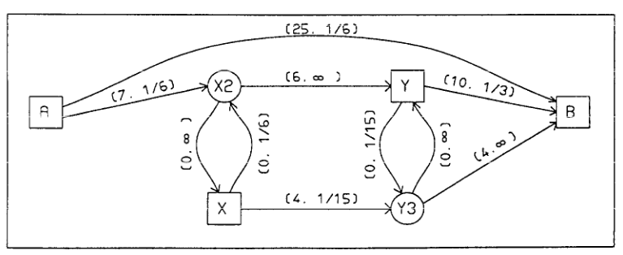
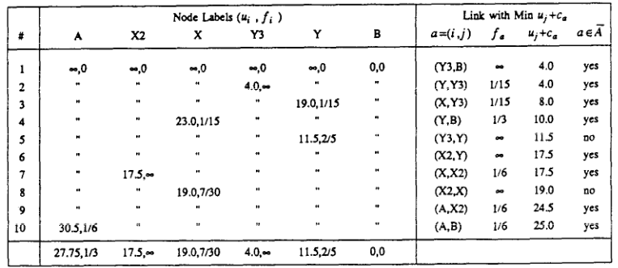
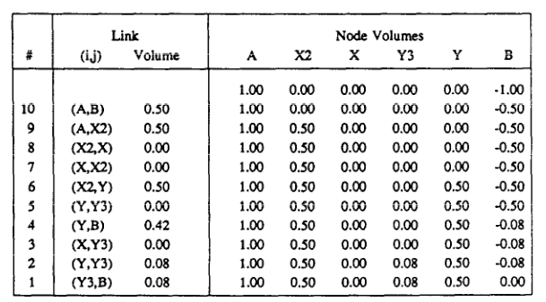

# An example following paper

Paper: [Spiess, H. and Florian, M. (1989) "Optimal strategies: A new assignment model for transit networks"](https://doi.org/10.1016/0191-2615(89)90034-9)

* From the root directory of this repository:
    ```shell
    cargo run --example paper
    ```

* How transit network looks like according to the paper:
<p align="center">

<p align="center">Fig 1. Transit network with link cost and frequencies</p>
</p>

So headways are:
* headway of A-B = 6 minutes
* A-X2 = 6
* X-X2 = 6
* Y3-Y = 15
* X-Y3 = 15
* Y-Y3 = 15
* Y-B = 3

Others headways are equal to zero, therefore frequencies are $+\inf$

Costs:
* travel cost of A-B = 25 minutes
* A-X2 = 7
* X2-Y = 6
* X-Y3 = 4
* Y3-B = 4
* Y-B = 10

Others travel costs considered to be equal to zero. But in real life cases transfers (maybe even boarding and alighting links) have positive travel costs.

```rust
let all_nodes: HashSet<String> = ["A", "X", "X2", "Y", "Y3", "B"]
    .iter()
    .map(|s| s.to_string())
    .collect();
let all_links = vec![
    Link::new("A", "B", "Line 1", 25.0, 6.0),
    Link::new("A", "X2", "Line 2", 7.0, 6.0),
    Link::new("X2", "X", "Line 2", 0.0, 0.0),
    Link::new("X", "X2", "Line 2", 0.0, 6.0),
    Link::new("X2", "Y", "Line 2", 6.0, 0.0),
    Link::new("Y3", "Y", "Line 3", 0.0, 15.0),
    Link::new("Y", "B", "Line 4", 10.0, 3.0),
    Link::new("X", "Y3", "Line 3", 4.0, 15.0),
    Link::new("Y", "Y3", "Line 3", 0.0, 15.0),
    Link::new("Y3", "B", "Line 3", 4.0, 0.0),
];
```

* Finding optimal strategy
We should find optimal strategy to reach destination node `B`. According to the paper we should got:
<p align="center">

<p align="center">Fig 2. Find optimal strategy for example network</p>
</p>

```shell
Optimal strategy:
        Node labels:
                u_{i} = B: 0.000000
                u_{i} = A: 27.750000
                u_{i} = X: 19.071429
                u_{i} = X2: 17.500000
                u_{i} = Y: 11.500000
                u_{i} = Y3: 4.000000
        Nodes probablities:
                f_{i} = A: 0.333333
                f_{i} = X: 0.233333
                f_{i} = X2: inf
                f_{i} = Y: 0.400000
                f_{i} = Y3: inf
                f_{i} = B: 0.000000
        Attractive links set:
                 a = (i, j) = (Y3, B)
                 a = (i, j) = (Y, Y3)
                 a = (i, j) = (X, Y3)
                 a = (i, j) = (Y, B)
                 a = (i, j) = (X2, Y)
                 a = (i, j) = (X, X2)
                 a = (i, j) = (A, X2)
                 a = (i, j) = (A, B)
```

Labels match the paper exactly (no big-M artifacts): nodes served by a
no-wait link report $f_i = +\inf$, and the attractive set is listed in
acceptance order, i.e. non-decreasing $u_j + c_a$ - the same order the
paper builds it in (p. 97).

* Assiging demand
Considering only one trip from node `A` to destination node `B`, we should got:
<p align="center">

<p align="center">Fig 3. Assign demand on example network</p>
</p>

```shell
Volumes:
        Links volumes:
                v_{i, j} = (X2, X): 0.000000
                v_{i, j} = (X2, Y): 0.500000
                v_{i, j} = (X, X2): 0.000000
                v_{i, j} = (X, Y3): 0.000000
                v_{i, j} = (Y3, Y): 0.000000
                v_{i, j} = (Y3, B): 0.083333
                v_{i, j} = (Y, B): 0.416667
                v_{i, j} = (Y, Y3): 0.083333
                v_{i, j} = (A, B): 0.500000
                v_{i, j} = (A, X2): 0.500000
        Nodes volumes:
                v_{i} = X2: 0.500000
                v_{i} = Y: 0.500000
                v_{i} = Y3: 0.083333
                v_{i} = B: 0.000000
                v_{i} = A: 1.000000
                v_{i} = X: 0.000000
```
